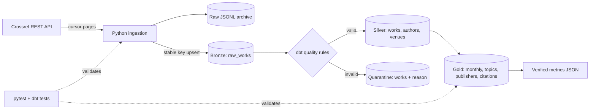

# AI Research Trends Data Pipeline

A beginner-friendly, end-to-end data engineering portfolio project that turns
public Crossref research metadata into tested AI research trend tables.

## What this project proves

- API ingestion with retries and cursor pagination
- Incremental loading with a saved high-water mark
- Idempotent upserts: rerunning a batch updates a DOI instead of duplicating it
- Bronze, Silver, and Gold data modeling in DuckDB and dbt
- Bad-record quarantine instead of silent data loss
- Python unit tests, dbt data tests, and GitHub Actions CI
- Reproducible metrics generated from the warehouse, not invented examples

## Architecture



### The layers in plain language

| Layer | Purpose | Main object |
|---|---|---|
| Raw | Immutable evidence of exactly what the API returned | `data/raw/*.jsonl` |
| Bronze | Latest source record, kept close to Crossref | `bronze.raw_works` |
| Silver | Clean, valid, analysis-ready entities | `silver_works`, `silver_authors`, `silver_venues` |
| Quarantine | Invalid rows plus an explicit reason | `quarantine_works` |
| Gold | Small tables ready for charts or business questions | monthly trends, topic trends, publishers, citations |

## Quick start

Requirements: Python 3.11+ and Git. No Docker or cloud account is needed.

### Windows PowerShell

```powershell
python -m venv .venv
.\.venv\Scripts\Activate.ps1
python -m pip install -r requirements.txt
python -m pip install -e .
Copy-Item .env.example .env
```

Optionally replace `your-email@example.com` in `.env`. Crossref is public and
requires no API key, but an email identifies the client to its polite pool.
PowerShell does not load `.env` automatically, so set it for the current shell:

```powershell
$env:CROSSREF_MAILTO = "you@example.com"
```

Run the complete pipeline:

```powershell
python -m ai_research_pipeline run --max-records 100
```

This performs ingestion and `dbt build` (seed + models + every dbt test), then
writes `reports/latest_metrics.json` from the resulting warehouse.

### macOS, Linux, or GitHub Codespaces

```bash
python -m venv .venv
source .venv/bin/activate
python -m pip install -r requirements.txt
python -m pip install -e .
python -m ai_research_pipeline run --max-records 100
```

## Incremental and idempotent: the interview explanation

After a successful run, the pipeline saves the greatest Crossref `indexed_at`
value in `ops.pipeline_state`. State is namespaced by query and date window, so
changing the search cannot accidentally reuse the old watermark. The next run adds Crossref's `from-index-date`
filter, so it asks only for records indexed since that point. Results are sorted
by indexed time ascending, which lets repeated capped demo runs move forward
instead of jumping directly to the newest matching record.

The boundary is intentionally inclusive. Crossref may return the final record
again, but `bronze.raw_works` uses a stable key (normally the lowercase DOI) and
`INSERT OR REPLACE`. The result is **at-least-once extraction with idempotent
warehouse state**: safer than risking a missed record, without duplicate DOIs.

`--max-records` is a safety cap for learning runs. A capped run is a sampled
checkpoint, not proof that every matching Crossref record has been ingested.

To deliberately ignore the watermark and backfill:

```powershell
python -m ai_research_pipeline ingest --full-refresh --from-pub-date 2024-01-01 --max-records 500
dbt build --project-dir dbt --profiles-dir dbt_profiles
```

## Data quality and quarantine

A record is quarantined if it has a missing DOI, missing title, missing/invalid
publication date, out-of-range year, or negative citation/reference count.
Additional tests enforce uniqueness, required fields, author-to-work
relationships, nonnegative aggregates, and no future publication dates.

Inspect rejected records without deleting them:

```sql
select doi, title, quarantine_reason
from quarantine.quarantine_works;
```

## Useful commands

```powershell
# Only fetch/load (no dbt)
python -m ai_research_pipeline ingest --max-records 50

# Choose a different search and publication window
python -m ai_research_pipeline run `
  --query "large language model" `
  --from-pub-date 2025-01-01 `
  --max-records 250

# Run Python tests
pytest

# Run seeds, transformations, and data tests without calling the API
dbt build --project-dir dbt --profiles-dir dbt_profiles

# Recreate the metrics file from the current warehouse
python -m ai_research_pipeline metrics
```

## Gold tables and questions answered

| Model | Question |
|---|---|
| `gold_papers_by_month` | Is publication volume changing over time? |
| `gold_topic_trends` | Which explicit AI keywords appear in paper titles by month? |
| `gold_top_publishers` | Which publishers dominate this extracted dataset? |
| `gold_citation_metrics` | What is the citation distribution in the dataset? |

Topic classification is deliberately transparent: dbt joins paper titles to
the editable keyword dictionary in `dbt/seeds/ai_topics.csv`. It is not an ML
classifier, and the project does not claim that unmatched papers have no topic.

## Verified local run

Verified on **2026-09-12** against the live Crossref API with query
`artificial intelligence`, publication lower bound `2024-01-01`, and two
consecutive 100-record runs:

| Check | Observed result |
|---|---:|
| Python unit tests | 5 passed |
| dbt build | 38 passed, 0 errors |
| Bootstrap ingestion | 100 fetched, 100 inserted, 0 updated |
| Incremental ingestion | 100 fetched, 99 inserted, 1 updated |
| Bronze / valid Silver works | 199 / 199 |
| Quarantined works | 0 |
| Exploded author rows | 490 |
| Publication window in this sample | 2024-01-01 to 2024-11-30 |
| Exact `Artificial Intelligence` title matches | 85 |

The citation snapshot for these 199 records was **0 total citations**. That is
an observed property of this small, oldest-indexed-first sample—not a claim
about AI research overall. The raw JSONL files, DuckDB database, and
`reports/latest_metrics.json` remain local and gitignored because future runs
can differ. Re-run the command to produce fresh, reproducible figures.

## Project layout

```text
.
├── src/ai_research_pipeline/  # API client, normalization, storage, CLI
├── dbt/
│   ├── models/                # Silver, quarantine, and Gold SQL models
│   ├── seeds/                 # Explainable AI-topic dictionary
│   └── tests/                 # Cross-model data-quality assertions
├── docs/architecture.md       # Design decisions and failure behavior
├── dbt_profiles/              # Local DuckDB connection
├── tests/                     # pytest unit tests
├── scripts/                   # Deterministic CI fixture loader
├── data/raw/                  # Runtime JSONL landing zone (gitignored)
├── reports/                   # Runtime verified metrics (gitignored)
└── .github/workflows/ci.yml   # Offline, deterministic CI
```

## Scope and honest limitations

- Crossref search relevance is not a complete census of all AI research.
- Citation counts are Crossref metadata snapshots, not a universal impact score.
- Keyword topics are explainable but cannot capture every synonym or context.
- The default 100-record run is an MVP demonstration, not a scientific result.
- Raw data may contain publisher-provided inconsistencies; quarantine makes them visible.

## Data source

Metadata comes from the public [Crossref REST API](https://www.crossref.org/documentation/retrieve-metadata/rest-api/).
No API key is required. Follow Crossref's etiquette by setting a real contact
email for larger runs and do not commit personal contact details to the repo.
